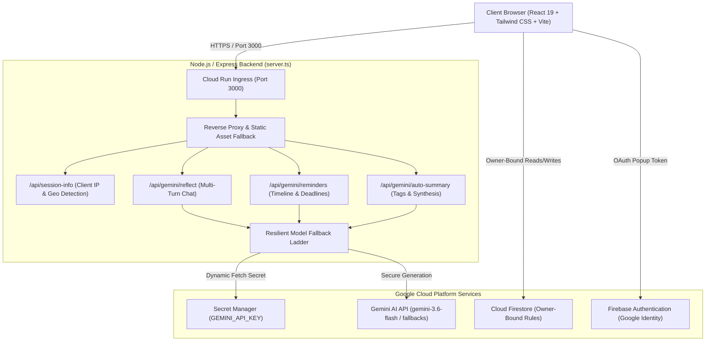
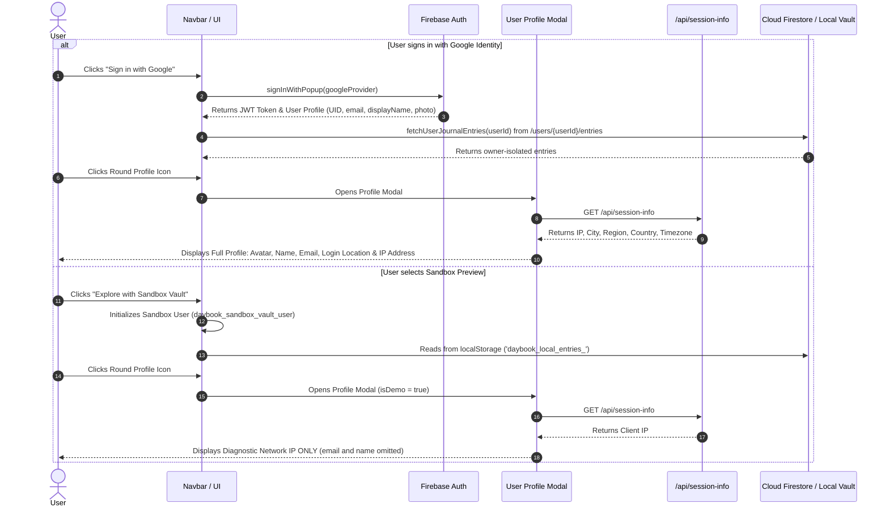
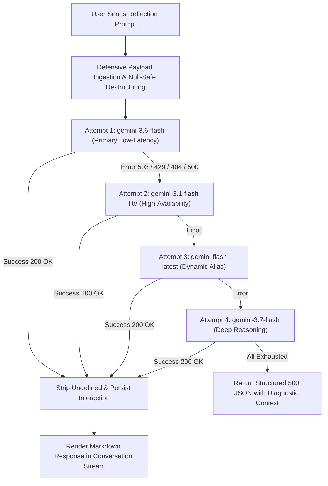
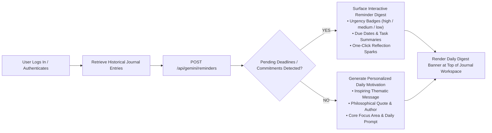

# Daybook — AI-Powered Journal & Cognitive Memory Engine

Daybook is an enterprise-grade, privacy-first cognitive journaling and memory reflection application built on **Google Cloud Run**, **Firebase Authentication**, **Cloud Firestore**, and **Gemini 3.6 Flash** via the `@google/genai` SDK.

---

## 📑 Table of Contents
1. [System Architecture & Flow Diagrams](#-system-architecture--flow-diagrams)
   - [1.1 High-Level System Architecture](#11-high-level-system-architecture)
   - [1.2 Authentication & Data Isolation Flow (Google vs. Sandbox)](#12-authentication--data-isolation-flow)
   - [1.3 Multi-Turn AI Reflection & Resilient Model Fallback Ladder](#13-multi-turn-ai-reflection--fallback-ladder)
   - [1.4 AI Reminder & Daily Motivation Engine Flow](#14-ai-reminder--daily-motivation-engine-flow)
2. [Repository Structure & Project Guide](#-repository-structure--project-guide)
3. [API Endpoints Reference](#-api-endpoints-reference)
4. [Agentic Threat Modeling & Security Directives](#-agentic-threat-modeling--security-directives)
5. [Firestore Security Rules](#-firestore-security-rules)
6. [How to Test Locally (Complete Step-by-Step Guide)](#-how-to-test-locally-complete-step-by-step-guide)
7. [Production Deployment to Google Cloud Run](#-production-deployment-to-google-cloud-run)
8. [Automated Verification & Labeling](#-automated-verification--labeling)

---

## 📊 System Architecture & Flow Diagrams

### 1.1 High-Level System Architecture



---

### 1.2 Authentication & Data Isolation Flow



---

### 1.3 Multi-Turn AI Reflection & Fallback Ladder



---

### 1.4 AI Reminder & Daily Motivation Engine Flow



---

## 🗂️ Repository Structure & Project Guide

```
├── .env.example                  # Documents required environment variables (GEMINI_API_KEY, APP_URL)
├── .gitignore                    # Prevents build artifacts and node_modules from being tracked
├── firebase-applet-config.json   # Generated Firebase project credentials and database identifiers
├── firebase-blueprint.json       # Intermediate schema representation for Firestore entities
├── firestore.rules               # Production owner-bound Firestore security rules
├── index.html                    # Root HTML document with theme styling and viewport configuration
├── metadata.json                 # AI Studio applet metadata, permissions, and server capabilities
├── package.json                  # Dependencies, TypeScript configuration, and unified build scripts
├── server.ts                     # Express + Vite backend proxy, Gemini SDK runner, and API endpoints
├── tsconfig.json                 # TypeScript compiler options (strict mode enabled)
├── vite.config.ts                # Vite 6 config with React and Tailwind CSS v4 plugins
├── public/                       # Static public assets and application icons
└── src/
    ├── main.tsx                  # React DOM entry point mounting root App
    ├── App.tsx                   # Main orchestrator: auth listener, view router, toast state
    ├── index.css                 # Global CSS variables, high-contrast light/dark themes
    ├── types.ts                  # Shared TypeScript interfaces, types, and enums
    ├── lib/
    │   └── firebase.ts           # Firebase SDK initialization, auth helpers, Firestore sanitizers
    └── components/
        ├── DailyDigestBanner.tsx # Proactive AI reminder and motivation banner component
        ├── EntryHistory.tsx      # Searchable, filterable vault history and export interface
        ├── JournalEditor.tsx     # Rich reflection editor, mode selector, multi-turn AI chat
        ├── LandingHero.tsx       # Authentication gateway (Google Sign-In & Sandbox Preview)
        ├── Navbar.tsx            # Header navigation, brand identity, profile trigger, theme toggle
        ├── NotificationToast.tsx # Global floating feedback toast notifications
        ├── ThreatModelModal.tsx  # Interactive 5-Zone Agentic Threat Model viewer
        └── UserProfileModal.tsx  # Dynamic modal showing location/IP/user info or sandbox IP only
```

---

## 🔌 API Endpoints Reference

All API routes are served server-side by `server.ts` to guarantee zero client exposure of API keys:

| Endpoint | Method | Description | Security & Defensive Hygiene |
| :--- | :--- | :--- | :--- |
| `/api/session-info` | `GET` | Extracts client IP from proxy headers (`x-forwarded-for`) and resolves geographical location. | Abort-controller timeout (2s), IPv6 cleaning, loopback fallback. |
| `/api/gemini/reflect` | `POST` | Multi-turn conversational cognitive reflection with 5 specialized personas. | Null-safe destructuring, fallback ladder (`3.6-flash` → `3.1-flash-lite` → `3.7-flash`). |
| `/api/gemini/reminders`| `POST` | Analyzes historical journal entries for pending tasks or produces daily motivation. | Sanitized timeline input, structured JSON response validation. |
| `/api/gemini/auto-summary` | `POST` | Generates rapid executive summary and categorical tags from raw reflection content. | Strips undefined fields, handles empty payloads safely. |
| `/api/health` | `GET` | Health check endpoint for container orchestrators and load balancers. | Returns `{ status: "ok", timestamp: ... }`. |

---

## 🛡️ Agentic Threat Modeling & Security Directives

| Threat Zone | Identified Risk | Countermeasure Implemented |
| :--- | :--- | :--- |
| **Zone 1: Input Surfaces** | Malformed payloads, oversized entries, or prompt injection via reflection text. | Strict schema destructuring, input sanitization, parameterization, and handling untrusted input strictly as data. |
| **Zone 2: Planning & Reasoning** | Prompt injection attempting to leak system instructions or bypass reflection guardrails. | Strict separation of user journal content from system instructions in prompt payloads. |
| **Zone 3: Tool Execution** | Exposure of Google Gemini API key or exhaustion of model rate limits. | Zero-secret client exposure (server-side only via Secret Manager); automated 4-stage model fallback ladder. |
| **Zone 4: Memory & State** | Cross-user journal data leaks or unauthorized collection scraping in Firestore. | Strict owner-bound paths (`/users/{userId}/entries/{entryId}`) protected by deployed `firestore.rules`. |
| **Zone 5: Inter-System Communication** | Token exfiltration or SSRF during geolocation lookups. | Whitelisted external endpoints, private IP subnet filtering (`10.x`, `192.168.x`, `127.x`), and abort-controlled timeouts. |

---

## 🔒 Cloud Firestore Security Rules

The application uses owner-bound path isolation. Deploy these rules via `deploy_firebase` or Firebase CLI:

```javascript
rules_version = '2';
service cloud.firestore {
  match /databases/{database}/documents {
    // User interactions subcollection
    match /users/{userId}/interactions/{interactionId} {
      allow read, write: if request.auth != null && request.auth.uid == userId;
    }
    // User journal entries subcollection
    match /users/{userId}/entries/{entryId} {
      allow read, write: if request.auth != null && request.auth.uid == userId;
    }
    // User root document and any nested collections
    match /users/{userId} {
      allow read, write: if request.auth != null && request.auth.uid == userId;
      match /{allUserPaths=**} {
        allow read, write: if request.auth != null && request.auth.uid == userId;
      }
    }
  }
}
```

---

## 🧪 How to Test Locally (Complete Step-by-Step Guide)

Follow these steps to run and thoroughly test the entire repository on your local machine:

### Step 1: Clone the Repository & Install Dependencies
```bash
git clone <YOUR_REPO_URL>
cd daybook
npm install
```

### Step 2: Configure Local Environment Variables
Create a local `.env` file in the root directory:
```bash
cp .env.example .env
```
Populate `.env` with your Gemini API key (obtainable from [Google AI Studio](https://aistudio.google.com/)):
```env
GEMINI_API_KEY="AIzaSyYourActualKeyHere"
APP_URL="http://localhost:3000"
```

### Step 3: Start the Development Server
```bash
npm run dev
```
The server will bind to `http://localhost:3000`. Open your browser and navigate to:
```
http://localhost:3000
```

---

### 📋 Local Testing Walkthrough Scenarios

#### Scenario 1: Verify Sandbox Preview & IP Address Display
1. On the landing screen, click **"Explore with Sandbox Vault"**.
2. Notice the instant transition into the main Daybook workspace in Sandbox mode.
3. Click the round **User Profile Avatar** in the top-right navbar.
4. **Expected Result**:
   - The modal title displays **"Sandbox Session Profile"**.
   - A banner explains that personal identity is omitted in sandbox mode.
   - Only the **Current IP Address** is displayed, along with a working **COPY** button.
   - User details like email and name are strictly hidden.
   - Click **COPY** — verify the label changes to "COPIED".

#### Scenario 2: Verify Google Sign-In, Location & User Details
1. In the top navbar, click the **Logout** button.
2. Click **"Sign in with Google"** and complete OAuth authentication.
3. Once logged in, click your round **Profile Picture** in the top navbar.
4. **Expected Result**:
   - Modal displays **"Account & Session Info"**.
   - Your Google Profile Picture, Full Display Name, and Email Address are visible.
   - **Login Location**: Displays City, Region, Country, and Timezone.
   - **IP Address**: Displays client public network IP with a one-click copy button.
   - **User Identifier**: Displays your isolated Firestore UID with copy button.
   - Click the **REFRESH** button to test dynamic re-fetching.

#### Scenario 3: Create & Save a Journal Entry
1. Select a mood chip (e.g., *Reflective*, *Grateful*, or *Inspired*).
2. Enter a Title: `"Q3 Architecture Milestone"`.
3. Type body content: `"Finalized Cloud Run deployment scripts and verified Secret Manager access."`
4. Click **"Save Reflection"** in the top right.
5. **Expected Result**:
   - Status transitions from *Saving...* to *Saved*.
   - A green toast appears: `"Reflection safely saved to Firestore."`
   - Data is stored in Firestore at `/users/{YOUR_UID}/entries/{entryId}` with undefined fields cleanly stripped.

#### Scenario 4: Multi-Turn Cognitive AI Reflection
1. Under the journal content, select a reflection mode: **Deep Reflection**, **Summary & Synthesis**, **Brainstorm Ideas**, **Action Plan**, or **Deep Questions**.
2. Type a question or prompt in the chat box: `"What are 3 next steps to validate this architecture?"`
3. Click the bright **Send** button (or press `Ctrl + Enter` / `Cmd + Enter`).
4. **Expected Result**:
   - Gemini responds with insightful, formatted Markdown text.
   - The fallback ladder operates seamlessly in the background.
   - Subsequent chat responses maintain conversational multi-turn context.

#### Scenario 5: Proactive AI Reminder & Motivation Engine
1. Click **"New Entry"** and create an entry with a specific deadline:
   `"Need to file quarterly tax report by next Friday at 5 PM."`
2. Save the entry, then refresh the page or click **"Refresh Insights"** on the banner.
3. **Expected Result**:
   - The **Daily Digest Banner** detects the pending deadline and surfaces a priority reminder with an urgency badge (`HIGH` or `MEDIUM`), due date, and one-click reflection spark.
4. Delete or complete the task, then click **"Refresh Insights"**.
   - **Expected Result**: The banner transitions to **Daily Motivation Mode**, displaying an uplifting quote, personalized affirmation, and focus area.

#### Scenario 6: Verify Vault History & Search
1. Click **"Vault History"** in the top navbar.
2. Use the search bar to search by keyword or filter by mood.
3. Verify the **Exit symbol button** returns smoothly to the editor.

#### Scenario 7: Theme Visuals Verification
1. Toggle the theme button in the navbar (Sun/Moon icon).
2. Verify all text, cards, popups, and inputs have high contrast and clear readability in both **Light Visuals** and **Dark Visuals** modes.

---

### Step 4: Validate Code Quality & Build Locally
```bash
# Run TypeScript typecheck
npm run lint

# Compile production bundle (Vite + esbuild server bundle)
npm run build

# Run production server
npm start
```
Ensure all tests and builds complete with zero errors.

---

## ☁️ Production Deployment to Google Cloud Run

### 1. Enable Required GCP APIs
```bash
gcloud services enable \
  run.googleapis.com \
  secretmanager.googleapis.com \
  firestore.googleapis.com \
  cloudbuild.googleapis.com
```

### 2. Configure Secret Manager Bindings
Store your Gemini API key in Secret Manager and grant the Cloud Run runtime service account the `secretAccessor` role:
```bash
# Create and populate the secret
gcloud secrets create GEMINI_API_KEY --replication-policy="automatic"
echo -n "YOUR_ACTUAL_GEMINI_API_KEY" | gcloud secrets versions add GEMINI_API_KEY --data-file=-

# Grant the Cloud Run default compute service account access
gcloud secrets add-iam-policy-binding GEMINI_API_KEY \
  --member="serviceAccount:YOUR_PROJECT_NUMBER-compute@developer.gserviceaccount.com" \
  --role="roles/secretmanager.secretAccessor"
```

### 3. Deploy to Cloud Run
```bash
gcloud run deploy reflection-studio \
  --source . \
  --region us-central1 \
  --allow-unauthenticated \
  --set-secrets GEMINI_API_KEY=GEMINI_API_KEY:latest
```

---

## 🏷️ Automated Verification & Labeling

To register the service for automated challenge verification, apply the mandatory campaign label:

```bash
gcloud run services update reflection-studio \
  --update-labels=dev-tutorial=cloud-run-ai-challenge \
  --region=us-central1
```

